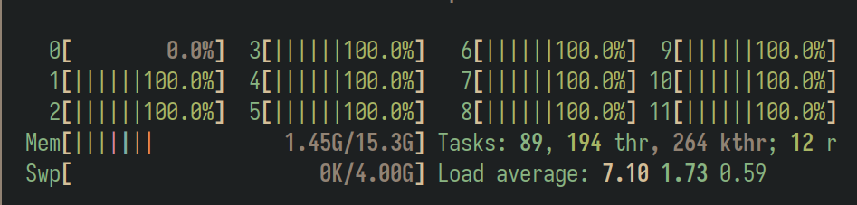
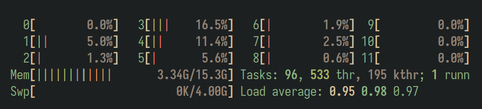
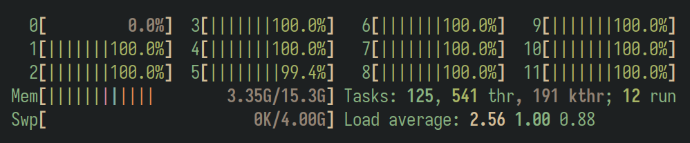
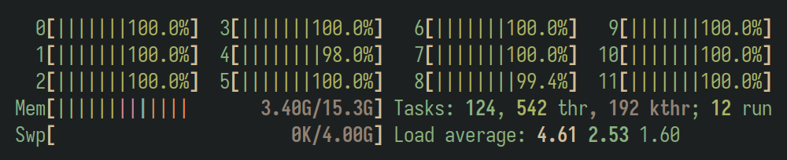

## Resumen

En este informe se va a explicar cómo aislar una CPU, de tal manera que se tenga el control sobre las tareas que se planifican en esa CPU, reduciendo el factor no determinista a la hora de realizar mediciones en un sistema operativo de ámbito común. Se mostrará cómo hacerlo y las implicaciones de usar esta técnica.

---

# Introducción

Este informe trata de, breve y descriptivamente, guiar al lector con el objetivo de que consiga aislar un núcleo del procesador, para más tarde asignárselo a un programa concreto. De esta manera se asegura que únicamente se ejecuta dicho programa sobre esta CPU, aumentando al máximo la localidad y la persistencia de los datos en caché, y eliminando el sobrecoste por cambios de contexto y la planificación de otras tareas.

El objetivo final es conseguir una medida temporal más precisa, eliminando al máximo el no determinismo introducido por el sistema operativo, el cual debido a que no fue concebido como máquina sobre la que realizar experimentos, no siempre ofrece el mayor rendimiento ni la estabilidad esperada por los científicos. Esta técnica acerca en gran medida el experimento a una ejecución determinista, pero ha de tenerse en cuenta que puede seguir habiendo mediciones que se salgan de lo esperado.

Si únicamente hay una tarea asignada a una CPU, el planificador del kernel de Linux la ejecuta hasta que termina, eliminando cambios de contexto y por supuesto la lucha por la CPU entre procesos. Aunque no hay que olvidarse que siempre hay un pequeño tiempo dedicado a las interrupciones del sistema operativo, y la elección de la nueva tarea a ejecutar, que aunque se resuelve rápidamente pues solo hay una, sigue existiendo.

# Configuración del sistema

A continuación se explicarán los pasos necesarios para configurar un sistema operativo Linux de tal manera que consigamos el comportamiento esperado. El propio kernel de Linux da soporte a esta técnica, pero no es conocida por la mayoría.

## Kernel cmdline

El primer paso consiste en modificar el parámetro `isolcpus` mediante la línea de comandos del kernel de Linux. Asumiendo que se usa grub, podemos editar el archivo `/etc/default/grub` y añadir a `GRUB_CMDLINE_LINUX` el kv `isolcpus=0` [^arch_kernel_params]. Esto hace que la CPU `0` quede aislada y no se use por el planificador por defecto. Más adelante veremos cómo planificar una tarea en una CPU en específico. Una vez se editó este archivo, para regenerar la entrada en el gestor de arranque usamos `update-grub` o en su defecto `sudo grub-mkconfig -o /boot/grub/grub.cfg`. Por último, debemos reiniciar el sistema operativo.

### Interludio, comprobación de funcionamiento

Podemos ejecutar el siguiente comando para recuperar la `cmdline` del kernel, y debemos ver `isolcpus=0` entre sus valores.

```sh
cat /proc/cmdline
```

Ahora, para comprobar de manera empírica su funcionamiento, vamos a, en una terminal, abrir un gestor de procesos como `top` o `htop`, y en otra ejecutar `stress` con un número de procesos igual al CPUs del equipo más una, asegurando la cobertura total según el principio del palomar.

El comando `stress` es un programa desarrollado por Jakub Klinkovský, quién lo describe como *Tool to impose load on and stress test a computer system* [^github_stress].



Como se puede ver en la figura anterior, la CPU 0, la asignada al parámetro `isolcpus` del kernel, no se usa para planificar tareas. Ahora vamos a proceder a asignarle esta CPU a nuestro programa.

## Selección determinista de CPU

Vamos a describir cómo seleccionar la CPU sobre la que se va a ejecutar un programa desde su propio código fuente, en este caso escrito en C. El primer paso es incluir las cabeceras necesarias,

```c
#include <sched.h>
```

Acto seguido, una única vez ha de configurarse la variable que almacena la información necesaria, en este caso llamada `cpuset`, para después usar `sched_setaffinity()` con la intención de atar este ejecutable a esa CPU. Esta función determina el conjunto de CPUs en las que una tarea puede ejecutarse [^man_sched_setaffinity].

```c
cpu_set_t cpuset;
CPU_ZERO(&cpuset);
CPU_SET(0, &cpuset);
sched_setaffinity(0, sizeof cpuset, &cpuset);
```

Debajo de estas sentencias se situaría el código necesario para llevar a cabo la tarea requerida, por ejemplo la medición de un bloque de código concreto.

# Uso de la técnica

Para usar esta técnica es suficiente con, una vez configurado el sistema, lanzar el programa con el bloque descrito anteriormente. En este informe no se va a estudiar la mejora obtenida frente a una ejecución normal. Tampoco se va a aplicar para ningún caso práctico. Únicamente se va a comparar la diferencia de correr el programa con el sistema operativo en descanso, y con todas las CPU saturadas, para demostrar que efectivamente la carga en tareas del sistema operativo no afecta al rendimiento de nuestro programa [^youtube_isolcpus] [^github_stress] [^wiki_linux_kernel].

### Programa de prueba

Para probar cómo rinde, se van a calcular el número 50 de la serie de Fibonacci, usando el algoritmo recursivo, mostrado a continuación:

```c
long
fib(int n)
{
        if (n <= 1) return 1;
        return fib(n - 1) + fib(n - 2);
}
```

El programa acepta dos parámetros: la CPU sobre la que se ejecutará y el número de Fibonacci a calcular. Para realizar las pruebas se lanzará `stress` [^github_stress] con 36 procesos a la vez que nuestro programa.



### Ejecución sin aislamiento

En esta primera ejecución se lanza el programa en el núcleo 1, con el objetivo de calcular el número de Fibonacci 43 (empezando a contar desde el 0). El resultado se asume que es el correcto, y tarda aproximadamente 10 segundos. La distribución del tiempo de procesador no fue equitativa, nuestro programa ocupó la CPU aproximadamente el 50% del tiempo, a pesar de que había 125 posibles tareas para ser planificadas, donde 36 de ellas eran el programa `stress` que debería ocupar gran parte del tiempo de CPU.

```
time ./fib 1 43
fib(43)=701408733
./fib 1 43  5.48s user 0.00s system 49% cpu 10.979 total
```



Se puede ver cómo la CPU 0 permanece inactiva, pues está reservada y nuestro programa no la utiliza.

### Ejecución con aislamiento

En esta ocasión lanzamos el programa en la CPU 0, que no utiliza ningún otro proceso de todos los planificados. El resultado esperado, y obtenido, es una mejora en el tiempo del doble, pues debería pasar, y así fue, de un uso del procesador del 50% al 100%. Como se muestra a continuación el tiempo fue de aproximadamente la mitad.

```
time ./fib 0 43
fib(43)=701408733
./fib 0 43  5.86s user 0.00s system 99% cpu 5.875 total
```



### Reflexiones del autor

El propio planificador es suficientemente inteligente como para distinguir qué programa tiene más prioridad. Me sorprendió lo difícil que me fue realizar las pruebas, ejecutadas como se describen anteriormente no se notaba una diferencia significativa. Para lograr el resultado esperado fue necesario lanzar el `stress` en la misma CPU que corría el programa, y bajándole el `nice`. También ha de tenerse en cuenta que se realizó una única medida, por lo que los resultados no indican nada más que el tiempo que tardó esa ejecución en ese contexto. Aun así, creo que basta para mostrar el efecto que causa esta técnica, y como no se va a usar esta medida para probar nada que no esté fundamentado teóricamente, es suficiente.

# Conclusiones

Para concluir, aunque esta técnica tiene una base teórica consistente, según el comportamiento estándar no supone una mejora de la escala que nos podríamos esperar. Estudiarla me hizo ser consciente de la precisión del planificador, lo bien que distinguía mi aplicación que estaba midiendo el tiempo de las que únicamente estaban consumiendo CPU. A pesar de los contratiempos tratando de esquivarlo, este método es fácil de aplicar y considero que nunca es una sobrecarga, por lo que podría ser de interés para realizar mediciones del rendimiento en tiempo de programas, sobre todo si el tiempo perdido por cambios de contexto es relevante.

También se podría usar en otros campos donde el número de CPUs sea más reducido, o sean más lentas, si por ejemplo se quiere dar prioridad total a una tarea.

Finalmente, me gustaría dejar como ejercicio para el lector revertir la configuración del kernel, y mencionar, para que quede constancia por escrito, que no me hago responsable de los daños ni problemas que puedan causarle a quien sigue el método utilizado en este informe.

# Apéndice A: Código fuente

A continuación se muestra el código fuente completo del programa `fib.c` utilizado en las pruebas:

```c
#define _GNU_SOURCE

#include <sched.h>
#include <stdio.h>
#include <stdlib.h>


long
fib(int n)
{
        if (n <= 1) return 1;
        return fib(n - 1) + fib(n - 2);
}

int
main(int argc, char **argv)
{
        int n = atoi(argv[2]);
        int c = atoi(argv[1]);

        cpu_set_t cpuset;
        CPU_ZERO(&cpuset);
        CPU_SET(c, &cpuset);
        sched_setaffinity(0, sizeof cpuset, &cpuset);

        printf("fib(%d)=%ld\n", n, fib(n));
        return 0;
}
```

# Apéndice B: Uso de IA

Como no podía ser de otra manera, la realización de este informe fue asistida por inteligencia artificial. Su uso se restringió a la corrección sintáctica y semántica, sin implicarla en la búsqueda de información ni en la redacción.

---

[^arch_kernel_params]: Referencia a parámetros del kernel para aislamiento de CPUs.
[^github_stress]: Jakub Klinkovský, *stress* — Tool to impose load on and stress test a computer system.
[^man_sched_setaffinity]: Manual de `sched_setaffinity(2)`.
[^youtube_isolcpus]: Referencia a vídeo sobre isolcpus.
[^wiki_linux_kernel]: Referencia a wiki del kernel de Linux.
